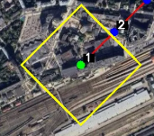
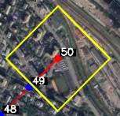
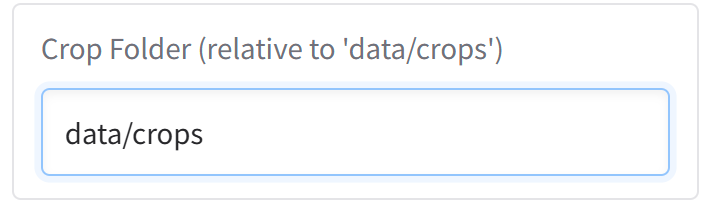
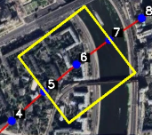
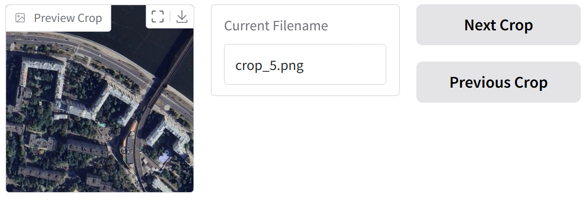
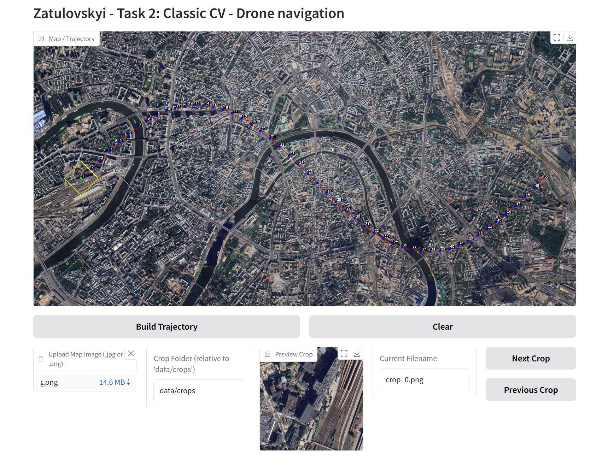

# Zatulovskyi - Task 2: Classic CV - Drone navigation

This project solves the challenge of reconstructing a drone's flight path from a series of aerial images matched to a satellite map. By detecting and matching visual features between drone images and the global map, the system determines the drone's position at each point and visualizes its complete trajectory.


Solution Overview
The solution uses computer vision techniques to localize each drone image on a global satellite map:

 

1. Feature-based localization: The SIFT algorithm extracts distinctive keypoints from both the satellite map and each drone image, which are then matched to find correspondences.
2. Geometric transformation: Using the matched keypoints, a homography matrix is calculated that maps points from the drone image to the satellite map.
3. Path reconstruction: By projecting the center point of each drone image onto the map and connecting these points, the flight trajectory is reconstructed.
4. Visualization: The trajectory is drawn on the satellite map with numbered points showing the order of images and different colors indicating the start (green) and end (red) of the path.
 
 
## Project Structure

```
DroneTrajectoryScan/
├── data/
│   ├── crops/           # Directory for drone images
│   ├── output/          # Generated trajectory visualizations
│   │   └── trajectory.jpg     # Map of the area marked with the drone's route
│   └── global_map.png   # Satellite map of the area
├── src/
│   ├── feature_extraction.py  # Feature detection and matching
│   ├── localization.py        # Image localization on map
│   ├── trajectory.py          # Trajectory building and smoothing
│   └── visualization.py       # Trajectory visualization
├── config.py            # Configuration parameters
├── interface.py         # Gradio web interface
├── main.py              # Main execution script
└── requirements.txt     # Required dependencies
```

## Requirements

* Python 3.7+
* OpenCV 4.5+
* NumPy
* SciPy (for trajectory smoothing)
* tqdm
* gradio (for GUI interface)
* Pillow

## Installation

1. Extract the "Zatulovskyi - task 2.zip" file to a directory of your choice:
```bash
unzip "Zatulovskyi - task 2.zip" -d drone_navigation
cd drone_navigation
```

2. Create a virtual environment and activate it:
```bash
python -m venv venv
source venv/bin/activate  # On Windows: venv\Scripts\activate
```

3. Install the required dependencies:
```bash
pip install -r Requirements.txt
```

4. Create the necessary directories if they don't exist:
```bash
mkdir -p data/output
```

## Usage

### Command Line Interface

Run the trajectory reconstruction via command line:

```bash
python main.py --map "data/global_map.png" --images_dir "data/crops" --output_dir "data/output"
```

Optional arguments:
- `--method`: Feature extraction method ('sift')
- `--smooth`: Apply trajectory smoothing
- `--visualize_positions`: Create a visualization with numbered drone positions
- `--view_boxes`: Generate an image showing the field of view boxes for each drone image

### Graphical Interface

Launch the Gradio interface for interactive exploration:

```bash
python interface.py
```

The interface allows you to:
1. Upload a map image


2. Select a folder with drone images



3. Navigate through drone images


4. View the location of each image on the map

 

5. Generate the complete trajectory visualization



## Algorithm

The trajectory reconstruction process consists of these main steps:

1. **Feature Extraction**: SIFT keypoints and descriptors are extracted from both the global map and each drone image
2. **Feature Matching**: Corresponding points between drone images and the global map are identified
3. **Homography Calculation**: A transformation matrix is computed to map points from the drone image to the global map
4. **Position Determination**: The center of each drone image is projected onto the global map
5. **Trajectory Building**: Connected points form the drone's path, optionally smoothed with spline interpolation
6. **Visualization**: The trajectory is rendered on the global map with numbered points

 

## Results

The output includes:
- `trajectory.jpg`: Global map with the drone's flight path and numbered points


## License

This project is licensed under the MIT License - see the LICENSE file for details.